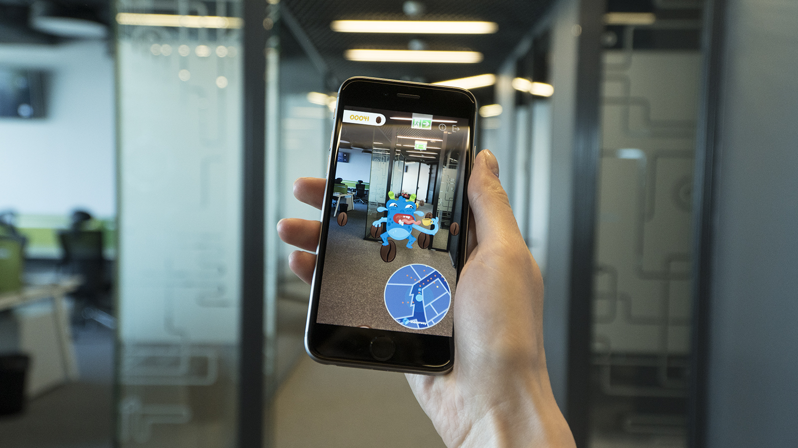

# Coffee Hunt

<p align="center">
  
</p>

In the not too distant future, global coffee crisis is taking place. Shortage of coffee and cocoa grains causes frustration, tiredness and leads to military conflicts. Coffee monsters are responsible for all those disasters. Help annihilate them and eat all grains before monsters eat you!

<p align="center">
  
</p>

## QR code

To play this game, you need to have the Indoorway service configured. Login to this game using the QR code of the application, which can be found in the Access tab in the Indoorway’s dashboard.

## Download

Application is ready to download at [Google Play](https://play.google.com/store/apps/details?id=com.indoorway.coffeehunt).

## Build instructions

Coffe Hunt app uses [Gradle](https://gradle.org/) as build tool. 

There are two ways of running project:

- using [Android Studio](https://developer.android.com/studio/index.html),
- calling [Gradle Wrapper] script in project directory and copying result apk to device: 

	```shell
	./gradlew :app:build
	```

## Community

In case of any troubles or questions contact us at [contact@indoorway.com](mailto:contact@indoorway.com) or visit [Indoorway Community Forum](https://community.indoorway.com).

## Contribute

Don't bother to fork this repository and make pull requests!

## Known issues

- bad quality hardware components and building structure may affect compass precision and game experience

## License

Coffe Hunt is shared under custom license. See [LICENSE file](./LICENSE).

## About Indoorway

Indoorway is a smart building solution for brick-and-mortar venues with an easy to implement API ecosystem. The company provides accurate indoor location and data analysis based on information gathered from beacons and mobile device sensors (e.g. gyroscope, accelerometer, geomagnetic field). Indoorway uses Big Data and Machine Learning algorithms to analyze end-users’ foot traffic and routines in real time. Indoorway serves as a Business Intelligence tool designed for venue owners, property managers and marketing teams to improve user experience and performance of any business facility. 
For more visit: indoorway.com